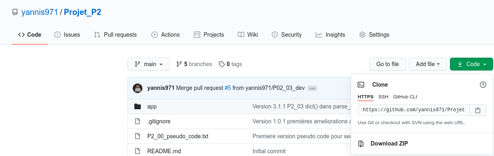

# Projet_P2
## Utilisez les bases de Python pour l'analyse de marché

### 1) Description de l'application

Ce projet consiste en une application python exécutable à la demande qui permet de "scrapper" le site <a href="http://books.toscrape.com/">Books to Scrape</a> afin de suivre les prix des livres chez ce revendeur de livres en ligne.

L'application s'exécute en mode console et possède 3 niveaux d'exécution :
1. produit :
2. catégorie :
3. site :

Pour chaque produit, elle récupère les informations suivantes :

* product_page_url
* universal_product_code (upc)
* title
* price_including_tax
* price_excluding_tax
* number_available
* product_description
* category
* review_rating
* image_url

Les données scrappées sont stockées dans des fichiers csv dans un répertoire `data` situé à la racine du projet. On stocke
un fichier csv produit si l'application est exécutée au niveau produit
un fichier csv par catégorie pour les autres niveaux d'exécution

Les images des produits sont téléchargées et sauvegardées dans le dossier `img` du répertoire `data` cité plus haut.

A chaque exécution de l'application, le répertoire `data` et son arborescence sont supprimés et recréés.

En fin de traitement, l'application affiche un compte-rendu sommaire d'exécution qui permet de vérifier la cohérence du nombre de fichiers et images stockés dans le répertoire `data`.

En cas d'anomalie détectée en cours d'exécution, un message est affiché dans la console.  

#### Architecture logicielle

#### GitFlow

* Branche `P02_01_dev` correspondant au scrapping d'un produit
* Branche `P02_02_dev` correspondant au scrapping d'un produit ou d'une catégorie de produit
* Branche `P02_03_dev` correspondant à la version finale du projet scrapping d'un produit ou d'une catégorie de produit ou du site dans son intégralité
* Branche 'main' et 'master' : version finale

### 2) Installation du projet en local sur votre machine

Sur votre machine créer un dossier dans lequel vous allez installer le projet.
On nommera par exemple ce dossier `test`. (vous pouvez le nommer autrement, c'est juste pour avoir une référence dans la suite des explications).

#### Première méthode : Téléchargement du fichier zip

Se rendre sur le dépot gitub : https://github.com/yannis971/Projet_P2

Dans l'onglet **<> Code** de la page ci-dessus, cliquer sur le bouton **Code** puis sur **Download ZIP**

#### Deuxième méthode : Clonage du dépôt avec git

Sur la figure précédente, copier le lien https

### 3) Configuration de l'environnement virtuel

#### Remarque

Les commandes ci-dessous (notamment celles concernant l'installation de pip pour python3) sont valables sur un système d'exploitation Linux de type Debian ou de ses dérivés.

Pour Windows, on utilise python et pip.

Pour Mac OS, on utilise python3 et pip3.

#### 3.1) Installer pip pour python3 si ce n'est pas déjà fait

Si la commande `pip3 --version` renvoie une erreur alors il convient d'installer pip

`sudo apt-get update && sudo apt-get install python3-pip`

Si l'installation a réussi, la commande vous renverra une ligne comme indiqué ci-dessous
`pip 20.2.3 from /home/yannis/.local/lib/python3.8/site-packages/pip (python 3.8)`

#### 3.2) Créer un environnement virtuel et l'activer

Se placer à la racine du projet (dossier dans lequel se trouve le fichier main.py) et lancer la commande :

`python3 -m venv env && source env/bin/activate`

#### 3.4) Installer les dépendances du projet

Toujours à la racine du projet, lancer l'une des 2 commandes suivantes :

`pip3 install -r requirements.txt`

`python3 -m pip install -r requirements.txt`

### 4) Exécution

#### 4.1) Renseigner l'URL à "scrapper"

Se déplacer dans le dossier app du projet et modifier la variable `URL` dans le fichier `parametres.py`

`URL = "https://books.toscrape.com/catalogue/scott-pilgrims-precious-little-life-scott-pilgrim-1_987/index.html"`

`URL = "https://books.toscrape.com/catalogue/category/books/sequential-art_5/index.html"`

`URL = "http://books.toscrape.com/"`

Enregistrer le fichier `parametres.py`

#### 4.2) Lancer l'application

Revenir à la racine du projet (dossier dans lequel se trouve le fichier main.py) et lancer l'application avec la commande suivante :

`python3 main.py`

Le script se lance

#### 4.3) Consulter et vérifier le résultat

Une fois le script terminé, vous pouvez consulter :
* les fichiers csv dans le dossier `data`
* les images dans le dossier `data/img/`

### 5) Licence

Pour ce projet, en plus de la bibliothèque standard `Python`, j'utilise les paquets `beautifulsoup4 version 4.9.3` et `pandas version 1.1.3` tous les 2 compatibles avec la licence **GPL**.

Par conséquent, je publie le code de ce projet sous licence libre **GNU GPL V3**

### 6) Questions/Aide/Support

E-mail : yannis.saliniere@gmail.com

Twitter : https://twitter.com/YSaliniere

https://github.com/yannis971/Projet_P2/issues
